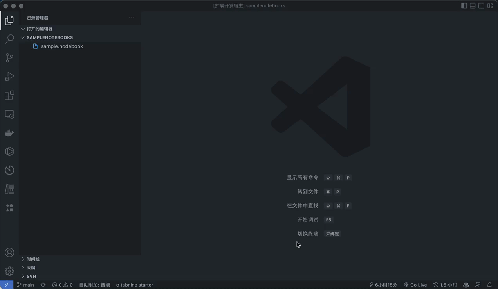

# 下班了吗 README

一个社畜人在周末加班的时候为了学习新技术写的一个小插件，用来判断是否下班了。

## Features

- [x] 可自定义下班时间
- [x] 底部状态栏显示剩余时间

## Release Notes

### 1.0.0

实现基本功能，可自定义下班时间，底部状态栏显示剩余时间。

### 1.0.1

修复了一个小 bug。

### 1.1.0

可自定义上下班时间。

-----------------------------------------------------------------------------------------------------------
## Following extension guidelines

Ensure that you've read through the extensions guidelines and follow the best practices for creating your extension.

* [Extension Guidelines](https://code.visualstudio.com/api/references/extension-guidelines)

## Working with Markdown

**Note:** You can author your README using Visual Studio Code.  Here are some useful editor keyboard shortcuts:

* Split the editor (`Cmd+\` on macOS or `Ctrl+\` on Windows and Linux)
* Toggle preview (`Shift+CMD+V` on macOS or `Shift+Ctrl+V` on Windows and Linux)
* Press `Ctrl+Space` (Windows, Linux) or `Cmd+Space` (macOS) to see a list of Markdown snippets

### For more information

* [Visual Studio Code's Markdown Support](http://code.visualstudio.com/docs/languages/markdown)
* [Markdown Syntax Reference](https://help.github.com/articles/markdown-basics/)

**Enjoy!**
